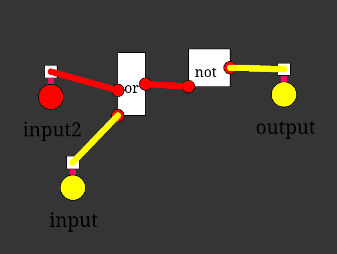

# Logic Simulator

> [!WARNING]  
> Esse projeto ainda está em construção!
> Muito do conteúdo está incompleto. Prossiga sabendo disso.

    

Simulador de portas lógicas feito para a web (usando Vite + p5.js).

Este simulador será usado eventualmente no projeto [logic-manual](https://github.com/UmBarril/logic-manual)

# Exemplo

Exemplo de como você poderia fazer um NOR dentro do simulador.

# FUTURO

- Implementar sistema de salvamento de circuitos.
- Implementar sistema de salvamento de projetos.
- Adicionar Toolbar para adicionar mais elementos na simulação,
- Adicionar sistema de correção de exercícios .(integração com [logic-manual](https://github.com/UmBarril/logic-manual/))
- Mudar a aparência para ficar mais atrativo.

# Inpirações

- [Digital](https://github.com/hneemann/Digital)
- [Digital Logic Sim](https://github.com/SebLague/Digital-Logic-Sim)

# Licença

Quaisquer código e conteúdo deste manual está sob a licença **GPLv3**. Veja mais sobre em [LICENSE](./LICENSE).
